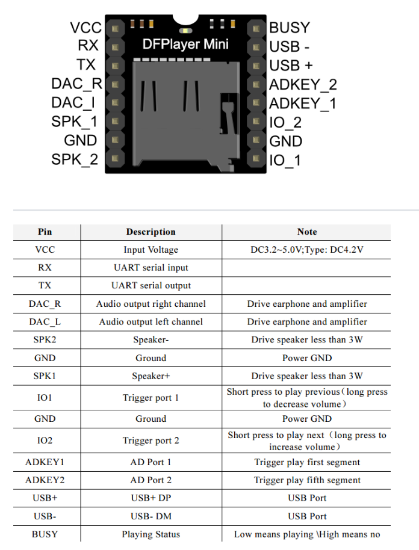
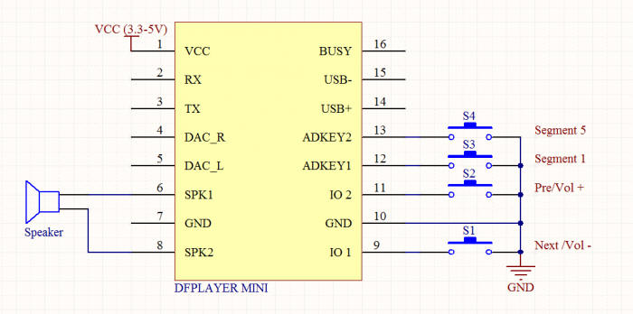
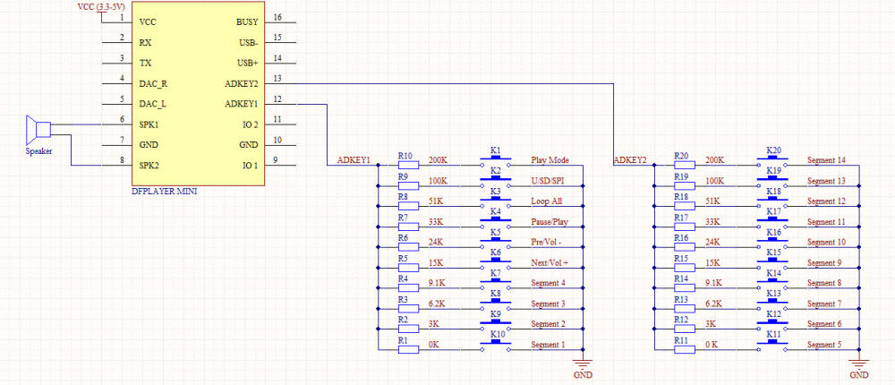
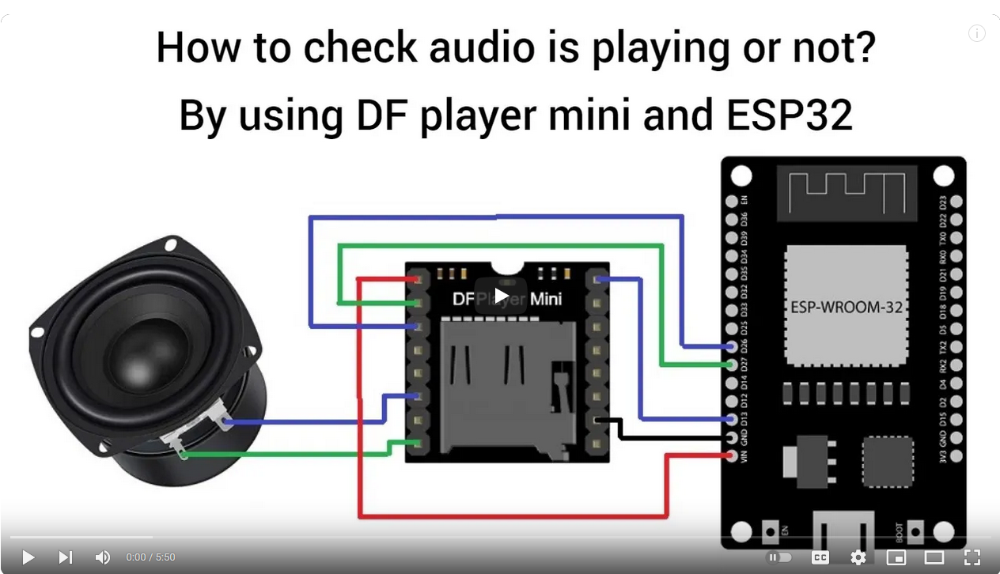

# DFPlayer - A Mini MP3 Player For Arduino


DFPlayer - A Mini MP3 Player For Arduino
https://www.dfrobot.com/index.php?route=product/product&product_id=1121

This example shows the all the function of library for DFPlayer.

Created 2016-12-07
By [Angelo qiao](Angelo.qiao@dfrobot.com)
Update more doc by Chau 2023-12-09

GNU Lesser General Public License.
See <http://www.gnu.org/licenses/> for details.
All above must be included in any redistribution

Notice and Trouble shooting

1.Connection and Diagram can be found here
https://www.dfrobot.com/wiki/index.php/DFPlayer_Mini_SKU:DFR0299#Connection_Diagram
2.This code is tested on Arduino Uno, Leonardo, Mega boards.


Document
https://wiki.dfrobot.com/DFPlayer_Mini_SKU_DFR0299











```

  //----Read imformation----
  Serial.println(myDFPlayer.readState()); //read mp3 state
  Serial.println(myDFPlayer.readVolume()); //read current volume
  Serial.println(myDFPlayer.readEQ()); //read EQ setting
  Serial.println(myDFPlayer.readFileCounts()); //read all file counts in SD card
  Serial.println(myDFPlayer.readCurrentFileNumber()); //read current play file number
  Serial.println(myDFPlayer.readFileCountsInFolder(3)); //read file counts in folder SD:/03


  myDFPlayer.play(1);  //Play the first mp3
  myDFPlayer.playFolder(15, 4);  //play specific mp3 in SD:/15/004.mp3; Folder Name(1~99); File Name(1~255)
  delay(1000);
  myDFPlayer.enableLoopAll(); //loop all mp3 files.
  delay(1000);
  myDFPlayer.disableLoopAll(); //stop loop all mp3 files.
  delay(1000);
  myDFPlayer.playMp3Folder(4); //play specific mp3 in SD:/MP3/0004.mp3; File Name(0~65535)
  delay(1000);
  myDFPlayer.advertise(3); //advertise specific mp3 in SD:/ADVERT/0003.mp3; File Name(0~65535)
  delay(1000);
  myDFPlayer.stopAdvertise(); //stop advertise
  delay(1000);
  myDFPlayer.playLargeFolder(2, 999); //play specific mp3 in SD:/02/004.mp3; Folder Name(1~10); File Name(1~1000)
  delay(1000);
  myDFPlayer.loopFolder(5); //loop all mp3 files in folder SD:/05.
  delay(1000);
  myDFPlayer.randomAll(); //Random play all the mp3.

```
